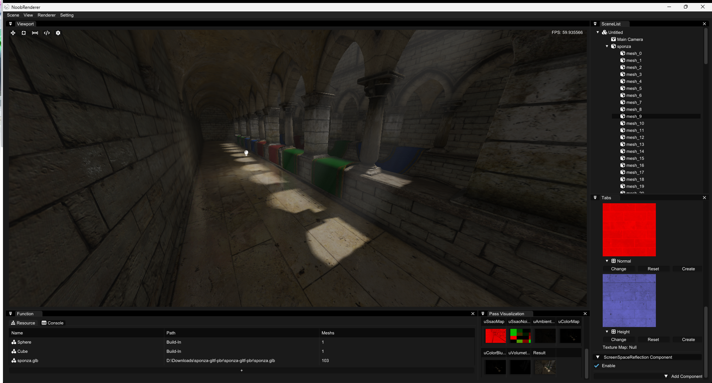
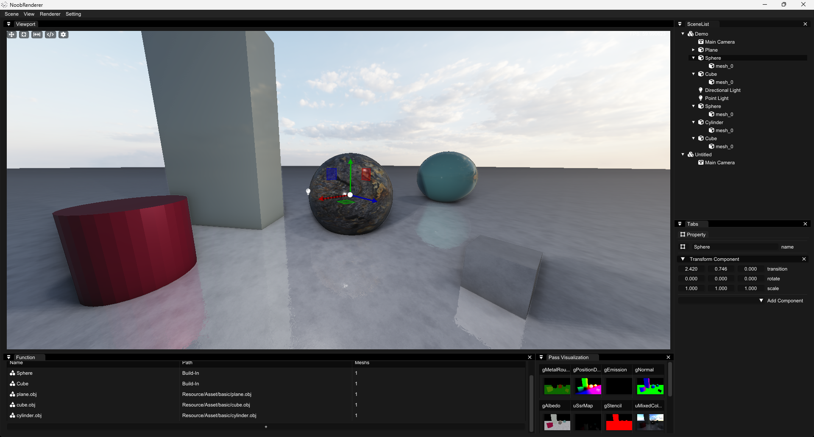

## NoobRenderer

NoobRenderer is a personal rendering project that I've been working on! It's based on C++ and OpenGL. This project is essentially my playground for learning and experimenting with OpenGL and various classical graphics algorithms. As such, it's a work in progress and may have many flaws.

### Build
All dependent third-party libraries are already included in this repo.
- CMake 3.10 (or more recent)
- MSVC (Visual Studio 2019 or more recent) or Mingw (Not tested yet)
```
cmake build & cd build
cmake --build . -j32
```

### Screenshots





### Features
- Deferred Shading pipeline
- Cascade ShadowMap, Omnidirectional Shadow, PCF, 
- Point Light, Directional Light
- PBR, Physically based rendering
- SSR, SSAO
- IBL, Image based lighting
- volumetric Lighting
- Future Work: ......

### Reference
- [Learnopengl](https://learnopengl.com/)
- [Learnopengl CN](https://learnopengl-cn.github.io/)
- [RendererGL](https://github.com/MorcilloSanz/RendererGL)
- [CarbonRender](https://github.com/carbonsunsu/CarbonRender)
- [ForkerRenderer](https://github.com/forkercat/ForkerRenderer)
- [Piccolo](https://github.com/BoomingTech/Piccolo)
- https://ogldev.org/www/tutorial49/tutorial49.html
- https://www.alexandre-pestana.com/volumetric-lights/
- https://lettier.github.io/3d-game-shaders-for-beginners/screen-space-reflection.html
- [Linearly Transformed Cosines](https://eheitzresearch.wordpress.com/415-2/)
- https://sugulee.wordpress.com/2021/01/19/screen-space-reflections-implementation-and-optimization-part-2-hi-z-tracing-method/